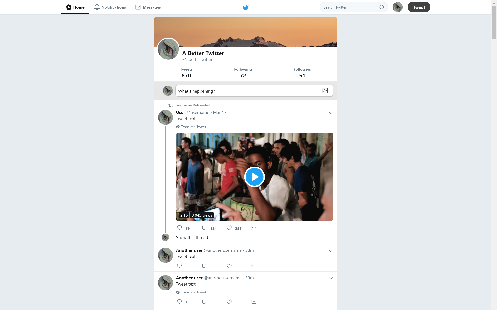

# A-Better-Twitter
## Just a CSS style for Twitter that removes some bullshit from the website.

    

You can use on your browser by installing Stylus, a extension that change the look and feel of web pages without collecting data about you:

Go to the old Twitter design using [GoodTwitter by Zusor](https://github.com/ZusorCode/GoodTwitterChrome) also avaliable to other browsers.

[Google Chrome](https://chrome.google.com/webstore/detail/stylus/clngdbkpkpeebahjckkjfobafhncgmne)

[Firefox](https://addons.mozilla.org/firefox/addon/styl-us/)

[Opera](https://addons.opera.com/extensions/details/stylus/)

Go to [install](https://userstyles.org/styles/155039/a-better-twitter)

You can send me suggestions or fixes as pull requests, if you do any, I will put your name on the thanks list.

### Thanks to those who helped me fix and maintain the style:

* Trigstur
* PendingChaos
* skaulana
